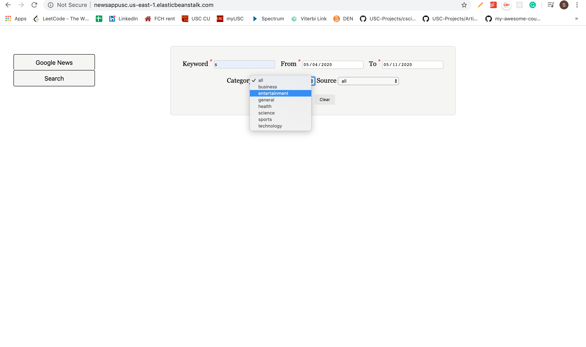
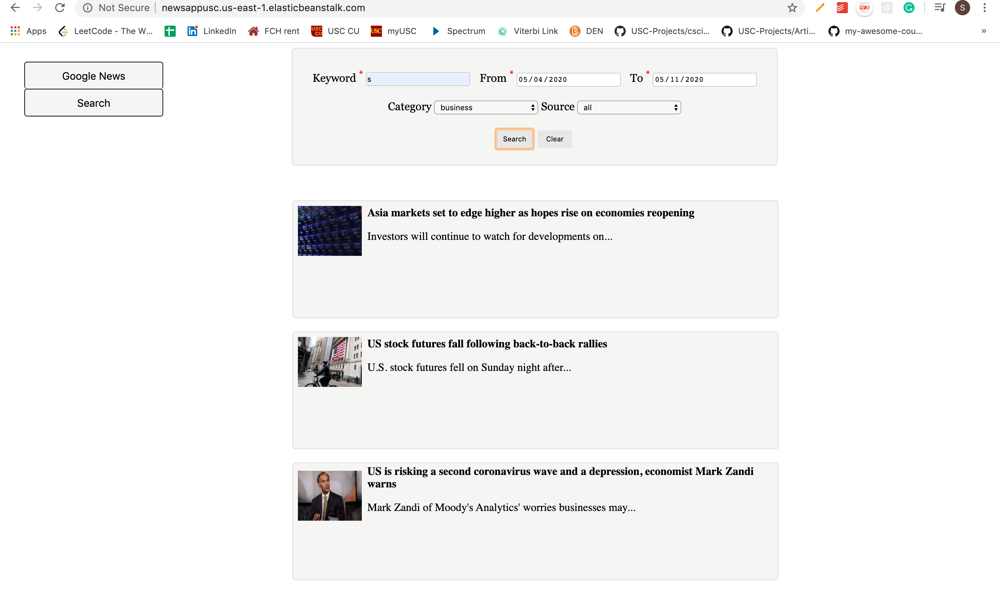

# Flask-NewsApp
Flask + Javascript powered WebApp using Google News API

It has been deployed on AWS- http://newsappusc.us-east-1.elasticbeanstalk.com/

### About
Creating a website using Google News API to display news from various sources and allow users to search for news based on parameters such as:

 - Keywords
 - Publish Date Range
 - Genre
 - Source

### External libraries and APIs

 - Google News API
 - d-3 cloud library

### Front-end Technologies

 - HTML
 - CSS
 - Javascript
 - AJAX

### Back-end Technologies

 - Flask (Python)
 
 ### Home Page
The home page has a carousel that shows the latest news from all sources. This news is fetched from the Google News API. The home page also features a word cloud of top 30 most frequently appearing words in news titles. 
The home page also displays the top 5 news articles from Fox News and CNN which are fetched using Google News API. 
The button on the left is used to toggle between the home page and the search page. 

### Screenshots
<h2>Home Page News</h2>

<h2>Filtering News</h2>

<h2>Search Results</h2>

